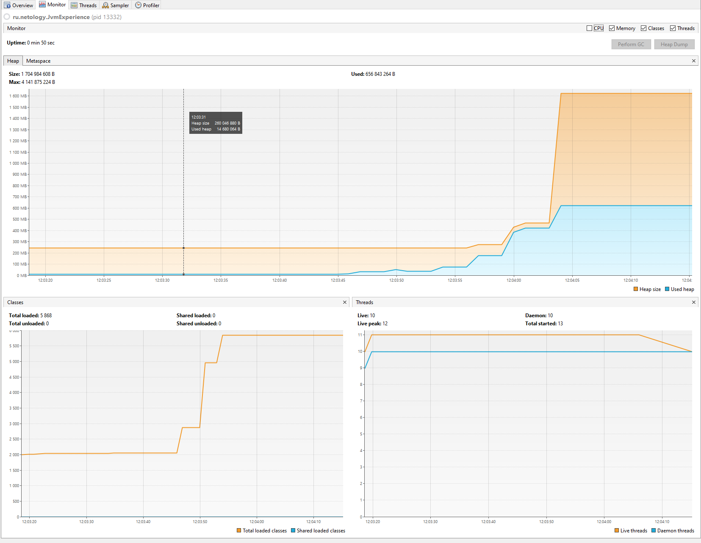
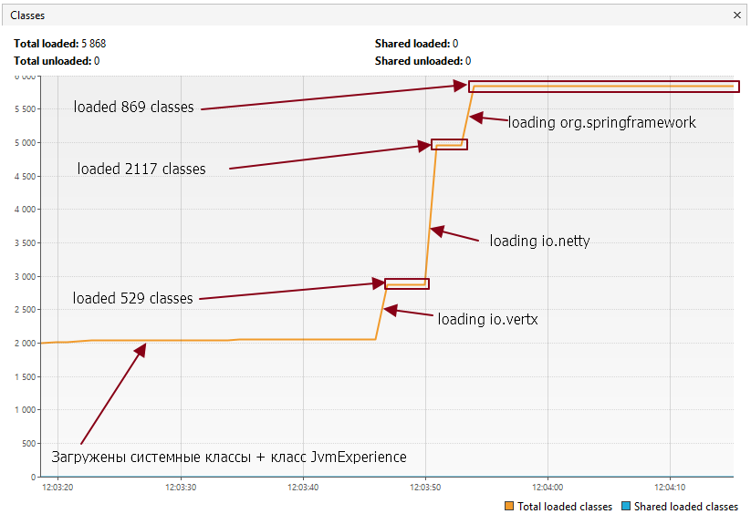
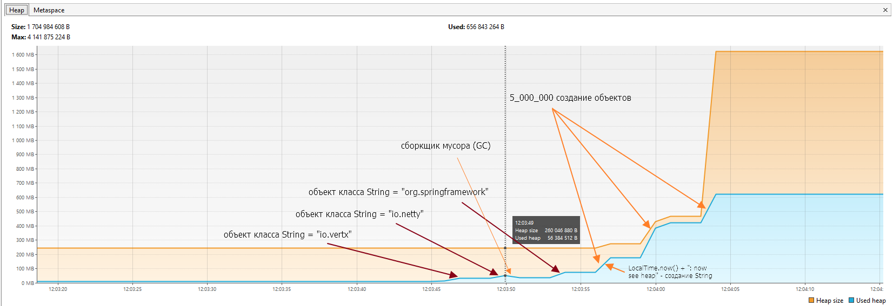
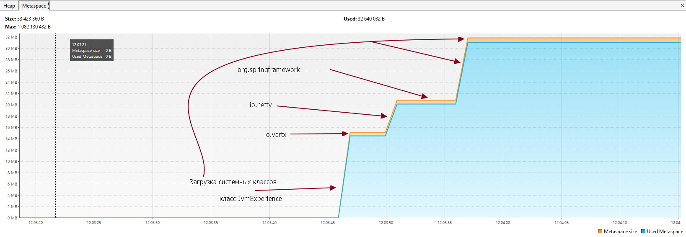

Домашнее задание для Netology.ru для курса Java Developer   

Описание и инструкция к выполнению [здесь](https://github.com/netology-code/jd-homeworks/tree/master/jvm/README.md)

# Задача "Исследование JVM через VisualVM"

## Описание
Предлагаем вам изучить использование памяти через VisualVM при загрузке новых классов и создании новых объектов

```text
12:03:16: Executing ':JvmExperience.main()'...

> Task :compileJava UP-TO-DATE
> Task :processResources NO-SOURCE
> Task :classes UP-TO-DATE

> Task :JvmExperience.main()
Please open 'ru.netology.JvmExperience' in VisualVm
12:03:46.590186800: loading io.vertx
12:03:46.870697: loaded 529 classes
12:03:49.879650900: loading io.netty
12:03:50.381367: loaded 2117 classes
12:03:53.394365800: loading org.springframework
12:03:53.576380200: loaded 869 classes
12:03:56.587150500: now see heap
12:03:56.587150500: creating 5000000 objects
12:03:56.747152200: created
12:03:59.755179200: creating 5000000 objects
12:03:59.917178700: created
12:04:03.130003100: creating 5000000 objects
12:04:03.502779500: created

BUILD SUCCESSFUL in 50s
2 actionable tasks: 1 executed, 1 up-to-date
12:04:07: Execution finished ':JvmExperience.main()'.
```

## Общая картина


### Classes


### Heap


### Metaspace
